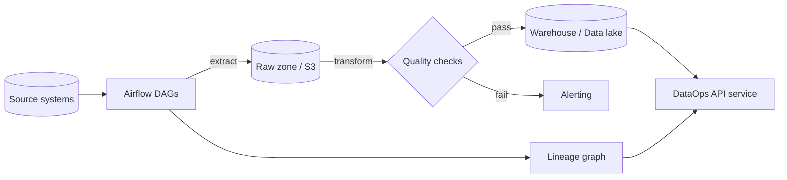

# DataOps Platform

[](LICENSE)
[](https://github.com/abhisheksawant52/dataops-platform/actions/workflows/ci.yml)
[](https://www.python.org/)
[](https://www.terraform.io/)
[](https://airflow.apache.org/)
[](https://github.com/psf/black)

A lightweight, opinionated **DataOps platform** that unifies the three
capabilities every data team needs but usually stitches together by hand:
**pipeline orchestration**, **data quality**, and **data lineage** — behind a
single typed Python package and FastAPI service, deployed with Terraform and
scheduled with Apache Airflow.

## Overview

Data platforms fail in predictable ways: pipelines run out of order, bad data
lands silently in the warehouse, and nobody can answer "where did this column
come from?". This project provides small, composable engines that address each
of those directly:

- an orchestration engine that runs tasks in dependency order,
- a data-quality engine that gates loads on declarative expectations, and
- a lineage graph that makes upstream/downstream impact queryable.

It is aimed at data and platform engineers who want a coherent, testable core
they can run locally, embed in Airflow tasks, or expose as a service.

## Architecture



Components:

- **Orchestration** (`dataops.orchestration`) — topological DAG runner built on
  `networkx`, with per-task `TaskRun` status tracking.
- **Data quality** (`dataops.quality`) — expectations engine over pandas
  DataFrames producing a `QualityReport`.
- **Lineage** (`dataops.lineage`) — a DAG of datasets and transformations with
  upstream/downstream queries and JSON export.
- **Service & API** (`dataops.service`, `dataops.main`) — a facade that wires
  the engines together, exposed over FastAPI.

## Features

- Declarative data-quality rules: `not_null`, `unique`, `in_range`,
  `regex_match`, and `row_count_between`, with a configurable fail threshold.
- Dependency-ordered pipeline execution with cycle detection.
- Dataset lineage graph with transitive impact analysis.
- FastAPI service with health, readiness, and metrics probes.
- Airflow DAGs for ETL and scheduled quality sweeps.
- Terraform for an AWS data platform (S3 data lake, Glue catalog, IAM, VPC).
- Multi-stage, non-root container image with a built-in health check.

## Tech Stack

Python 3.11+ · FastAPI · pandas · networkx · pydantic · structlog · SQLAlchemy ·
Apache Airflow · Terraform · AWS (S3, Glue, IAM) · pytest · ruff · black

## Getting Started

### Prerequisites

- Python 3.11 or newer
- `make` (optional, for convenience targets)
- Terraform >= 1.5 and Docker (optional, for infra and images)

### Install and run

```bash
python -m venv .venv && source .venv/bin/activate
make install            # pip install -e ".[dev]"

# Run the API locally (http://127.0.0.1:8000, docs at /docs)
dataops                 # console script -> uvicorn

# Or run the test suite
make test
```

### Terraform

```bash
cd terraform
terraform init -backend-config=environments/dev/backend.hcl
terraform plan -var-file=environments/dev/terraform.tfvars.example
```

### Airflow

Point Airflow's DAGs folder at `airflow/dags/` with the `dataops` package
installed in the same environment — see [`airflow/README.md`](airflow/README.md).

## Project Structure

```
.
├── src/dataops/              # Python package
│   ├── config.py             # pydantic-settings configuration
│   ├── logging_config.py     # structlog setup
│   ├── models.py             # pydantic domain models
│   ├── orchestration.py      # networkx DAG runner
│   ├── quality.py            # data-quality rules engine
│   ├── lineage.py            # lineage graph
│   ├── service.py            # orchestrator facade
│   └── main.py               # FastAPI app + `run()` entrypoint
├── tests/                    # pytest suite
├── terraform/                # AWS data-platform IaC
│   ├── main.tf ... versions.tf
│   ├── modules/network/      # reusable VPC/subnet/SG module
│   └── environments/{dev,prod}/
├── airflow/dags/             # ETL and data-quality DAGs
├── docs/architecture.md      # architecture deep-dive
├── Dockerfile                # multi-stage, non-root image
└── .github/workflows/ci.yml  # lint / test / terraform / docker
```

## Configuration

All settings are read from `DATAOPS_`-prefixed environment variables (and an
optional `.env` file). See [`.env.example`](.env.example).

| Variable                          | Default                 | Description                                          |
| --------------------------------- | ----------------------- | ---------------------------------------------------- |
| `DATAOPS_DB_URL`                  | `sqlite:///dataops.db`  | SQLAlchemy database URL for metadata.                |
| `DATAOPS_WAREHOUSE`               | `local`                 | Target warehouse identifier.                         |
| `DATAOPS_ENV`                     | `development`           | Deployment environment name.                         |
| `DATAOPS_LOG_LEVEL`               | `INFO`                  | Logging verbosity.                                   |
| `DATAOPS_QUALITY_FAIL_THRESHOLD`  | `0.0`                   | Fraction of failing rules tolerated before failure. |

## Deployment

1. **Infrastructure** — provision the data platform with Terraform using the
   per-environment backend and variables under `terraform/environments/`.
2. **Orchestration** — deploy the Airflow DAGs from `airflow/dags/` with the
   `dataops` package available to the workers.
3. **Service** — build and run the container image:

   ```bash
   make build
   docker run -p 8000:8000 ghcr.io/abhisheksawant52/dataops-platform:latest
   ```

## Contributing

Contributions are welcome — see [CONTRIBUTING.md](CONTRIBUTING.md) and our
[Code of Conduct](CODE_OF_CONDUCT.md).

## Security

Please report vulnerabilities as described in [SECURITY.md](SECURITY.md).

## License

Released under the [MIT License](LICENSE).
