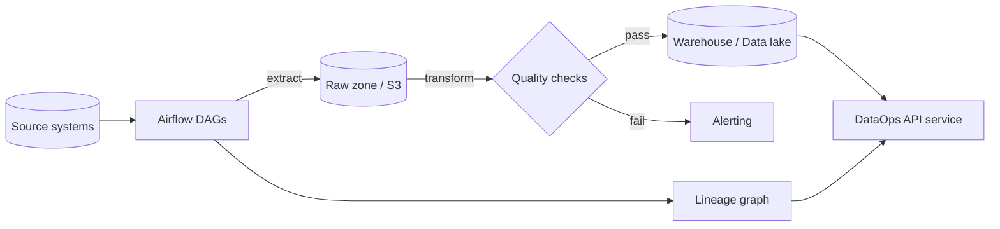

# Architecture

The DataOps platform is organised around three cooperating engines —
**orchestration**, **data quality**, and **lineage** — exposed through a
FastAPI service and driven in production by Apache Airflow.

## High-level flow

## Components

- **Orchestration** (`dataops.orchestration`) — builds a task DAG with
  `networkx`, resolves a topological execution order, runs tasks, and records a
  `TaskRun` per task. Airflow is the production scheduler; the in-process
  `DAGRunner` is used for lightweight local runs and tests.
- **Data quality** (`dataops.quality`) — a rules engine evaluating expectations
  (`not_null`, `unique`, `in_range`, `regex_match`, `row_count_between`) over a
  pandas DataFrame, producing a `QualityReport`. A configurable fail threshold
  determines whether a report passes.
- **Lineage** (`dataops.lineage`) — a `networkx` directed acyclic graph of
  datasets and transformations, supporting upstream/downstream queries and
  JSON export.
- **Service** (`dataops.service`) — the `DataOpsService` facade that wires the
  engines together and is shared by the API and Airflow tasks.
- **API** (`dataops.main`) — a FastAPI app exposing health/readiness/metrics
  probes plus endpoints to run pipelines, validate data, and query lineage.

## Infrastructure

Terraform provisions the AWS-flavoured data platform:

- An S3 **data lake** bucket (versioned, KMS-encrypted, public access blocked).
- A **Glue catalog** database for table metadata.
- An **IAM role** assumed by pipeline execution.
- A reusable **network** module (VPC, private subnets, security group).

State is stored in S3 with DynamoDB locking, configured per environment under
`terraform/environments/`.

## Configuration

All runtime settings are read from `DATAOPS_`-prefixed environment variables
(see `.env.example`), loaded via `pydantic-settings`.
